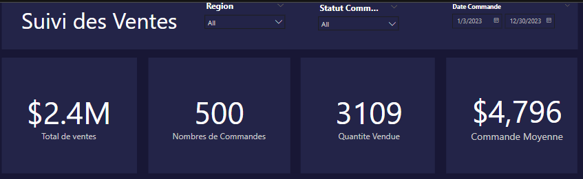
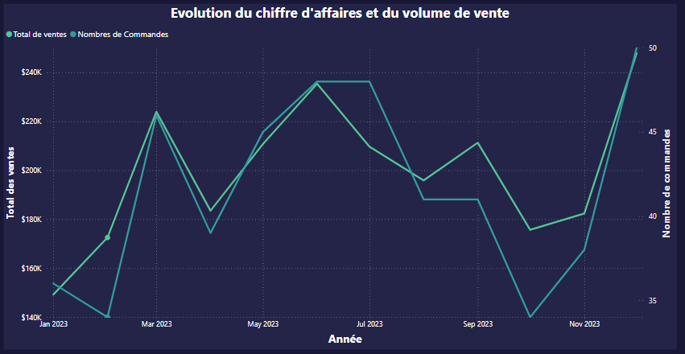
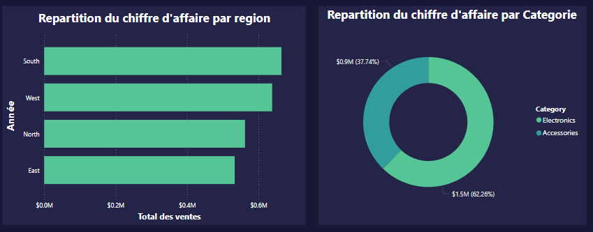
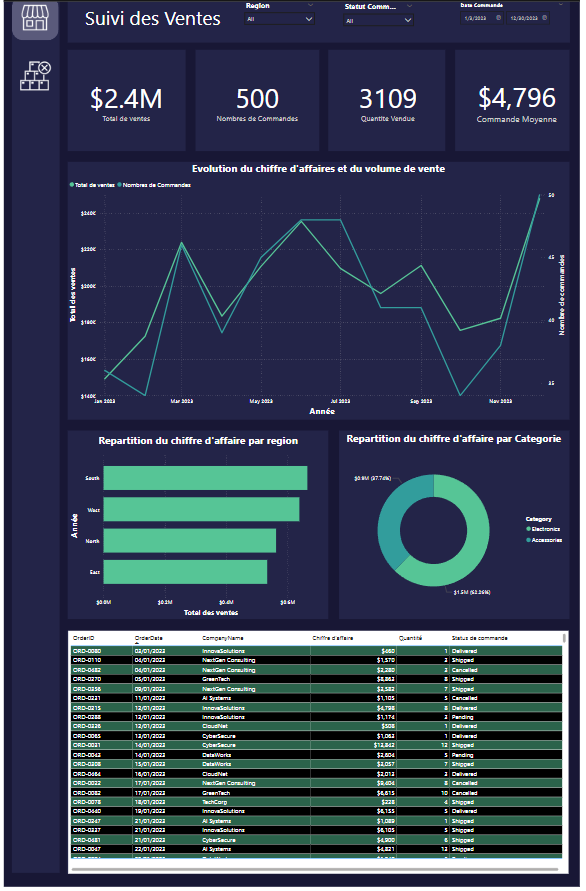
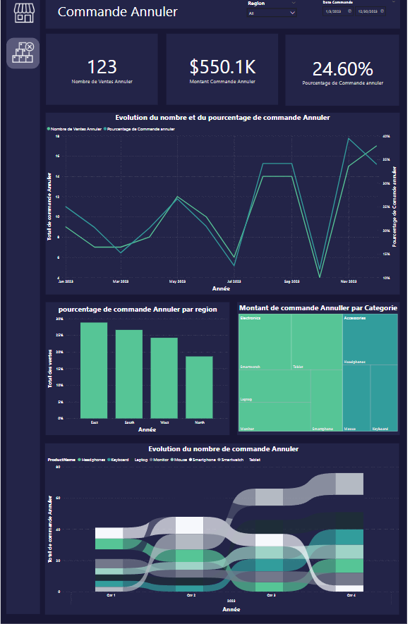

# Projet BI — Description et rendu

Ce projet Power BI a pour objectif de transformer et visualiser une table de ventes brute afin de produire un tableau de bord métier clair et actionnable. Le livrable principal est un fichier Power BI Desktop (.pbix) structuré autour d'un modèle de données normalisé et d'un rapport visuel en deux pages : une page principale d'analyse commerciale et une page dédiée aux commandes annulées.

Description détaillée

Le projet commence par l'ingestion d'une source de ventes brute (CSV / Excel / base) contenant, typiquement, les colonnes suivantes :

- Id commande, Date commande
- Id client, Nom client
- Id produit, Nom produit, Catégorie produit
- Id région, Nom région
- Quantité, Prix unitaire, Prix total
- Statut commande (ex. Delivered, Cancelled, Pending)

L'objectif opérationnel est d'obtenir un dataset prêt pour l'analyse :

- Corriger les types et la qualité des données (dates, nombres, textes, valeurs manquantes/erreurs).
- Extraire des tables de référence (Clients, Produits, Régions) pour éliminer les duplications et standardiser les clés.
- Construire une table de faits `Ventes` optimisée pour l'analyse temporelle et agrégée.

Le fichier `.pbix` final contient le modèle, les mesures DAX principales et deux pages de rapport orientées métier.

Étendue et hypothèses

- Les exemples visuels fournis ici sont des captures d'écran issues d'une maquette du rapport. Ils illustrent la mise en page, les choix de couleurs et le type d'analyses attendues.
- On suppose que chaque `Id` (client/produit/région) est stable après nettoyage ; des vérifications de doublons et rapprochements manuels peuvent être nécessaires.

Principaux objectifs :

- Nettoyer et valider la qualité et les types de données.
- Normaliser la donnée (tables de référence : Clients, Produits, Régions) et créer la table de faits `Ventes`.
- Construire un modèle relationnel cohérent et des mesures DAX pour le reporting.
- Concevoir un dashboard visuel professionnel avec : KPI, évolution temporelle, répartitions par région et catégorie, tableau des commandes, filtres, menu de navigation et infobulles.

Technologies et livrables

- Power BI Desktop (Power Query + Modélisation + Visualisations)
- Fichier Power BI (.pbix) final contenant :
  - Tables : Clients, Produits, Régions, Ventes
  - Table `Mesures` pour centraliser les mesures DAX
  - Deux pages de rapport : "Ventes" et "Commandes annulées"
- Ce dépôt contient des captures d'écran illustratives dans le dossier `images/`.

Public cible

- Analystes et décideurs marketing/ventes qui souhaitent suivre le chiffre d'affaires, les volumes, le comportement des annulations et la répartition par région et par catégorie produit.

Rendu visuel (captures)

Ci-dessous des exemples des rendus finaux du rapport. Ces images servent à documenter l'apparence attendue du dashboard et sont incluses depuis le dossier `images/`.

Titre et bandeau (KPI et filtres)

Légende :
- Positionnement : bandeau supérieur contenant le titre du rapport, les slicers principaux (période, région, statut) et 4 KPI.
- KPI affichés : `Total ventes`, `Nombre de commandes`, `Quantité vendue`, `Commande moyenne`.
- Interactions : cliquer sur un KPI filtre les visuels de la page ; les slicers sont synchronisables entre pages.

Évolution du chiffre d'affaires et volumes (exemple de graphique)

Légende :
- Type : courbe / aires affichant le CA (axe principal) et le volume (axe secondaire) par période (jour/semestre/année selon granularité).
- Champs utilisés : `Date commande` en axe, `Prix total` en valeur (summed), `Quantité` en valeur secondaire.
- Insight : permet d'identifier tendances saisonnières, pics promotionnels et périodes à analyser.

Répartition du CA par région et catégorie (exemple)

Légende :
- Type : graphique combiné (barres horizontales pour régions, couches ou couleurs par catégorie) ou visualisation empilée.
- Champs utilisés : `Region` en axe, `Prix total` en somme groupée par `Catégorie produit`.
- Insight : met en lumière les régions les plus performantes et les catégories dominantes par zone.

Rendu final — Page principale (Ventes)

Détails de la page :
- Composition : KPI, évolution temporelle, répartition régionale, donut par catégorie, tableau détaillé des commandes.
- Table de détails : `Id commande`, `Date commande`, `Client`, `Produit`, `Quantité`, `Prix total`, `Statut commande`.
- Paramètres visuels : thème sombre (`#1E2D38` fond, `#232448` conteneurs), hauteur de page 2000 px.

Conseils d'utilisation : cliquer sur une barre régionale ou une tranche du donut filtre automatiquement le tableau des commandes.

Rendu final — Page dédiée aux commandes annulées

Détails de la page :
- Objectif : analyser les annulations par produit, par région et dans le temps.
- Mesures clés : `Total commandes annulées`, `Montant commandes annulées`, `Pourcentage commandes annulées`.
- Visuels : KPI, courbe d'évolution du pourcentage d'annulations, histogramme par région, treemap CA annulé par catégorie/produit, visualisation "Ruban" trimestrielle par produit.

Comment interpréter : rechercher corrélations entre pics d'annulation et périodes/produits spécifiques ; ceci informe retours produit, logistique ou support client.

video de demonstration :
[video demo](video_demo.mp4)